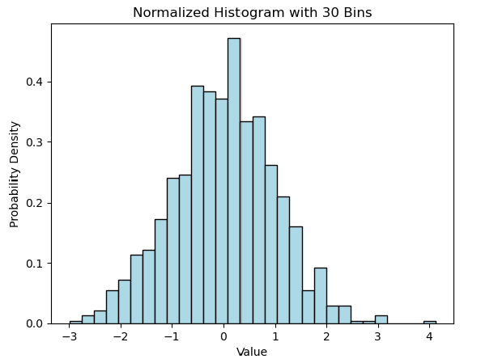
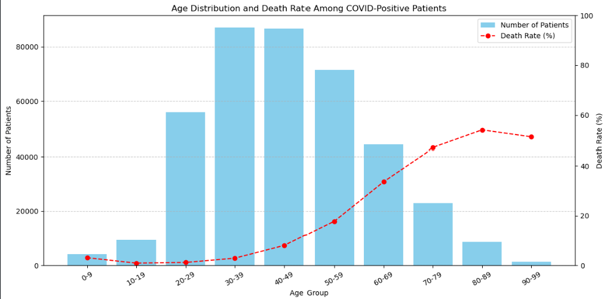

# Assignment

## Instructions

Paste the answer to each question in the answer code section below each question.

### Question 1

Given the following numpy array:

```python
arr = np.array([1, 2, 3, 4, 5])
```

Write a Python code to multiply each element in the array by 2.

Answer:

```python
Given the following numpy array:
arr = np.array([1, 2, 3, 4, 5])
Write a Python code to multiply each element in the array by 2.
Answer:
import numpy as np
arr = np.array([1, 2, 3, 4, 5])
arr * 2

answer: array([ 2,  4,  6,  8, 10])
```

### Question 2

Given the following 2D numpy array:

```python
arr = np.array([[1, 2, 3], [4, 5, 6], [7, 8, 9]])
```

Write a Python code to select the second row of the array.

Answer:

```python
import numpy as np
arr = np.array([[1, 2, 3], [4, 5, 6], [7, 8, 9]])
arr [1:2]

answer: array([[4, 5, 6]])
```
### Question 3

Given the following 2D numpy array:

```python
arr = np.array([[1, 2, 3], [4, 5, 6], [7, 8, 9]])
```

Write a Python code to calculate the average of all the elements.

Answer:

```python
import numpy as np
arr = np.array([[1, 2, 3], [4, 5, 6], [7, 8, 9]])
average = np.mean(arr)
average

answer: 5.0
```
### Question 4

Question: Select all numeric columns except float from the DataFrame `dft`.

Answer:

```python
import pandas as pd
import numpy as np

# Sample DataFrame with mixed types
dft = pd.DataFrame({
    "int_col": [1, 2, 3],              
    "float_col": [1.1, 2.2, 3.3],      
    "str_col": ["a", "b", "c"],         
    "bool_col": [True, False, True] 
    result = dft.select_dtypes(include=["number"], exclude=["float"])
    })
answer:   
   a
0  1
1  2
2  3
```

### Question 5

Question: How do you return the last 3 rows of a DataFrame `df`?

Answer:

```python
import pandas as pd

dft = pd.DataFrame({
    "int_col": [1, 2, 3],              
    "float_col": [1.1, 2.2, 3.3],      
    "str_col": ["a", "b", "c"],         
    "bool_col": [True, False, True] 
})

# Select only numeric columns, but exclude float types
result = dft.select_dtypes(include=["number"], exclude=["float"])

# Display the last 3 rows of the result
print(result.tail(3))


answer:
     int_col
0        1
1        2
2        3
```

### Question 6

Question: Return the minimum and maximum of a Series `x` as a new Series with the index `["min", "max"]`.

Answer:

```python
import pandas as pd

x = pd.Series([5, 2, 9, 1, 7])

result = pd.Series([x.min(), x.max()], index=["min", "max"])

print(result)

answer:

min    1
max    9
dtype: int64
```

### Question 7

Question: How do you select rows from a DataFrame where any value in the row exceeds a threshold?

```python
import pandas as pd

df = pd.DataFrame({'A': [1, 2, 3, 4, 5], 'B': [10, 20, 30, 40, 50]})
threshold = 30
```

Answer:

```python
import pandas as pd

df = pd.DataFrame({'A': [1, 2, 3, 4, 5], 'B': [10, 20, 30, 40, 50]})
threshold = 30
#gt  means greater than

# Select rows where any value exceeds the threshold and gt represents greater for the below code
result = df[df.gt(threshold).any(axis=1)]

print(result)

answer:
   A   B
3  4  40
4  5  50
```

### Question 8

Question: How do you compute the cumulative sum of a column in a DataFrame?

```python
import pandas as pd

df = pd.DataFrame({'A': [1, 2, 3, 4, 5]})
```

Answer:

```python
import pandas as pd

df = pd.DataFrame({'A': [1, 2, 3, 4, 5]})

# Compute cumulative sum of column 'A'
df['cumulative_sum'] = df['A'].cumsum()

print(df)

answer:
   A       cumulative_sum
0  1               1
1  2               3
2  3               6
3  4              10
4  5              15
```

### Question 9

Question: How do you convert a Series of strings to uppercase?

```python
import pandas as pd

series = pd.Series(['apple', 'banana', 'cherry'])
```

Answer:

```python
import pandas as pd

# Create a Series
series = pd.Series(['apple', 'banana', 'cherry'])

# Convert all strings in the Series to uppercase
uppercase_series = series.str.upper()

print(uppercase_series)
```
answer:
0     APPLE
1    BANANA
2    CHERRY

### Question 10

Question: Calculate the correlation between 'MSFT' and 'IBM' returns from a DataFrame of stock returns.

```python
import pandas as pd

# Assuming 'returns' is a DataFrame containing stock returns
returns = pd.DataFrame({
    'MSFT': [0.05, 0.07, -0.01],
    'IBM': [0.04, 0.02, 0.03]
})
```

Answer:

```python
import pandas as pd

# Creating the DataFrame
returns = pd.DataFrame({
    'MSFT': [0.05, 0.07, -0.01],
    'IBM': [0.04, 0.02, 0.03]
})
# Calculating the correlation between MSFT and IBM returns
returns['MSFT'].corr(returns['IBM'])

answer:
-0.2401922307076306

Findings: A moderate negative correlation between MSFT and IBM returns over those 3 periods — when one goes up, the other tends to go down (but this is based on a very small sample size, so it is  not statistically strong).
```

### Question 11

Question: Slice the Series to return data from 5th to 15th January.

```python
import pandas as pd
import numpy as np

dates = pd.date_range("2023-01-01", "2023-01-31")
data = pd.Series(np.random.rand(len(dates)), index=dates)
```

Answer:

```python
import pandas as pd
import numpy as np  # NumPy is still required to generate random numbers

# Generate 1st Jan 2023 - 31st Jan 2023
dates = pd.date_range("2023-01-01", "2023-01-31")
data = pd.Series(np.random.rand(len(dates)), index=dates)

# Slice the Series to return data from 5th to 15th January
sliced_data = data['2023-01-05':'2023-01-15']

print(sliced_data)

answer:
2023-01-05    0.959361
2023-01-06    0.637501
2023-01-07    0.275106
2023-01-08    0.243632
2023-01-09    0.492348
2023-01-10    0.305240
2023-01-11    0.743821
2023-01-12    0.806562
2023-01-13    0.624068
2023-01-14    0.955297
2023-01-15    0.828564
```

### Question 12

Question: How to plot a histogram with 30 bins for `data` in matplotlib? Label the x and y axis as `X` and `Y` respectively.

```python
data = np.random.randn(1000)
```

Answer:

```python
import matplotlib.pyplot as plt

data = np.random.randn(1000)

# Plot a normalized histogram with 30 bins
plt.hist(data, bins=30, density=True, color='lightblue', edgecolor='black')

plt.title("Normalized Histogram with 30 Bins")
plt.xlabel("Value")
plt.ylabel("Probability Density")

plt.show()
import matplotlib.pyplot as plt

data = np.random.randn(1000)

# Plot a normalized histogram with 30 bins
plt.hist(data, bins=30, density=True, color='lightblue', edgecolor='black')

plt.title("Normalized Histogram with 30 Bins")
plt.xlabel("Value")
plt.ylabel("Probability Density")

plt.show()

```


### Question 13

Question: How do you create a bar plot in seaborn using the `tips` dataset to show the average tip amount per day?

```python
import seaborn as sns
tips = sns.load_dataset('tips')
```

Answer:

```python
import seaborn as sns

tips = sns.load_dataset('tips')

# Create bar plot of average tip amount per day
sns.barplot(x='day', y='tip', data=tips)

plt.title("Average Tip Amount per Day")
plt.xlabel("Day of Week")
plt.ylabel("Average Tip")

plt.show()
```


### Question 14

Question: How to create a box plot for total_bill categorized by day in the `tips` dataset using seaborn?

Answer:

```python
import seaborn as sns
import matplotlib.pyplot as plt

# Assuming `tips` DataFrame is already loaded and has 'tip_pct' column

# 1) Boxplot for total_bill by day
plt.figure(figsize=(5, 5))
sns.boxplot(x="day", y="total_bill", data=tips,showmeans=True)
plt.title("Total Bill Distribution by Day")
plt.xlabel("Day of Week")
plt.ylabel("Total Bill ($)")

plt.show()
```

## Submission
