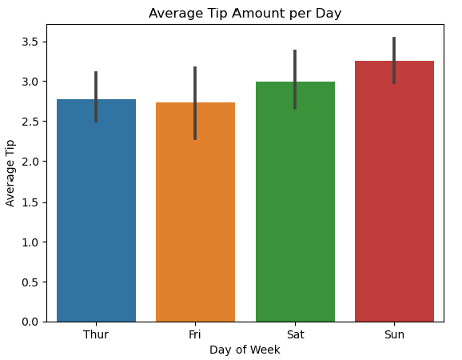

# COVID-19 Patient Analysis

## Dataset

I worked with the following dataset: [COVID-19 Patient](https://www.kaggle.com/datasets/meirnizri/covid19-dataset/data)

The dataset was provided by the Mexican government, and contains the following information:
- usmer: Indicates whether the patient treated medical units of the first, second or third level
- medical_unit: Type of institution of the National Health System that provided the care
- sex: 1 - female; 2 - male
- patient_type: Type of care the patient received in the unit. 1 for returned home and 2 for hospitalization
- date_died: If the patient died indicate the date of death, and 9999-99-99 otherwise
- intubed: Whether the patient was connected to the ventilator
- pneumonia: Whether the patient already have air sacs inflammation or not
- age: Patient's age
- pregnant: Whether the patient is pregnant or not
- diabetes: Whether the patient has diabetes or not
- copd: Whether the patient has Chronic obstructive pulmonary disease or not
- asthma: Whether the patient has asthma or not
- inmsupr: Whether the patient is immunosuppressed or not
- hipertension: Whether the patient has hypertension or not
- other_disease: Whether the patient has other disease or not
- cardiovascular: Whether the patient has heart or blood vessels related disease
- obesity: Whether the patient is obese or not
- renal_chronic: Whether the patient has chronic renal disease or not
- tobacco: Whether the patient is a tobacco user
- clasiffication_final: Covid test results. Values 1-3 mean that the patient was diagnosed with covid in different degrees. 4 or higher means that the patient is not a carrier of covid or that the test is inconclusive.
- icu: whether the patient had been admitted to an Intensive Care Unit

*NOTE*: In the boolean features, 1 means "yes" and 2 means "no". values as 97 and 99 are missing data 

📦 **Dataset Download Instructions**
1. Download the dataset ZIP file from the above link.
2. After downloading: Unzip the file to access Covid Data.csv. Note the full file path to Covid Data.csv — you'll need it in the next step.

## Business Question
What factors are associated with increased risk of death among COVID-19 patients in Mexico?

*To answer the above question, use pandas, matplotlib and seaborn to clean and explore the dataset, visualise your findings and address the following questions:*

# Initial Raw Data Information
Code:
```python

import pandas as pd

df = pd.read_csv('Covid Data.csv')
df

```
|    |   USMER |   MEDICAL_UNIT |   SEX |   PATIENT_TYPE | DATE_DIED   |   INTUBED |   PNEUMONIA |   AGE |   PREGNANT |   DIABETES |   COPD |   ASTHMA |   INMSUPR |   HIPERTENSION |   OTHER_DISEASE |   CARDIOVASCULAR |   OBESITY |   RENAL_CHRONIC |   TOBACCO |   CLASIFFICATION_FINAL |   ICU |
|---:|--------:|---------------:|------:|---------------:|:------------|----------:|------------:|------:|-----------:|-----------:|-------:|---------:|----------:|---------------:|----------------:|-----------------:|----------:|----------------:|----------:|-----------------------:|------:|
|  0 |       2 |              1 |     1 |              1 | 03/05/2020  |        97 |           1 |    65 |          2 |          2 |      2 |        2 |         2 |              1 |               2 |                2 |         2 |               2 |         2 |                      3 |    97 |
|  1 |       2 |              1 |     2 |              1 | 03/06/2020  |        97 |           1 |    72 |         97 |          2 |      2 |        2 |         2 |              1 |               2 |                2 |         1 |               1 |         2 |                      5 |    97 |
|  2 |       2 |              1 |     2 |              2 | 09/06/2020  |         1 |           2 |    55 |         97 |          1 |      2 |        2 |         2 |              2 |               2 |                2 |         2 |               2 |         2 |                      3 |     2 |
|  3 |       2 |              1 |     1 |              1 | 12/06/2020  |        97 |           2 |    53 |          2 |          2 |      2 |        2 |         2 |              2 |               2 |                2 |         2 |               2 |         2 |                      7 |    97 |
|  4 |       2 |              1 |     2 |              1 | 21/06/2020  |        97 |           2 |    68 |         97 |          1 |      2 |        2 |         2 |              1 |               2 |                2 |         2 |               2 |         2 |                      3 |    97 |

# Basic Summary Statistics
Code:
```python

df.describe().round(2)
```		
|       |       USMER |   MEDICAL_UNIT |         SEX |   PATIENT_TYPE |      INTUBED |    PNEUMONIA |           AGE |     PREGNANT |     DIABETES |         COPD |       ASTHMA |      INMSUPR |   HIPERTENSION |   OTHER_DISEASE |   CARDIOVASCULAR |      OBESITY |   RENAL_CHRONIC |      TOBACCO |   CLASIFFICATION_FINAL |          ICU |
|:------|------------:|---------------:|------------:|---------------:|-------------:|-------------:|--------------:|-------------:|-------------:|-------------:|-------------:|-------------:|---------------:|----------------:|-----------------:|-------------:|----------------:|-------------:|-----------------------:|-------------:|
| count | 1.04858e+06 |    1.04858e+06 | 1.04858e+06 |    1.04858e+06 |  1.04858e+06 |  1.04858e+06 |   1.04858e+06 |  1.04858e+06 |  1.04858e+06 |  1.04858e+06 |  1.04858e+06 |  1.04858e+06 |    1.04858e+06 |     1.04858e+06 |      1.04858e+06 |  1.04858e+06 |     1.04858e+06 |  1.04858e+06 |            1.04858e+06 |  1.04858e+06 |
| mean  | 1.63219     |    8.98057     | 1.49926     |    1.19076     | 79.5229      |  3.34683     |  41.7941      | 49.7656      |  2.1864      |  2.26057     |  2.24263     |  2.29813     |    2.12899     |     2.43514     |      2.26181     |  2.12518     |     2.25718     |  2.21433     |            5.30565     | 79.554       |
| std   | 0.482208    |    3.72328     | 0.5         |    0.392904    | 36.8689      | 11.9129      |  16.9074      | 47.5107      |  5.42424     |  5.13226     |  5.11409     |  5.46284     |    5.2364      |     6.64668     |      5.19485     |  5.17545     |     5.13535     |  5.3231      |            1.88117     | 36.8231      |
| min   | 1           |    1           | 1           |    1           |  1           |  1           |   0           |  1           |  1           |  1           |  1           |  1           |    1           |     1           |      1           |  1           |     1           |  1           |            1           |  1           |
| 25%   | 1           |    4           | 1           |    1           | 97           |  2           |  30           |  2           |  2           |  2           |  2           |  2           |    2           |     2           |      2           |  2           |     2           |  2           |            3           | 97           |
| 50%   | 2           |   12           | 1           |    1           | 97           |  2           |  40           | 97           |  2           |  2           |  2           |  2           |    2           |     2           |      2           |  2           |     2           |  2           |            6           | 97           |
| 75%   | 2           |   12           | 2           |    1           | 97           |  2           |  53           | 97           |  2           |  2           |  2           |  2           |    2           |     2           |      2           |  2           |     2           |  2           |            7           | 97           |
| max   | 2           |   13           | 2           |    2           | 99           | 99           | 121           | 98           | 98           | 98           | 98           | 98           |   98           |    98           |     98           | 98           |    98           | 98           |            7           | 99           |	


# Duplicate and Missing Values                                                        Code:
Code:
```python
duplicates = df[df.duplicated()]
print(duplicates)
```
 |         |   USMER |   MEDICAL_UNIT |   SEX |   PATIENT_TYPE | DATE_DIED   |   INTUBED |   PNEUMONIA |   AGE |   PREGNANT |   DIABETES |   COPD |   ASTHMA |   INMSUPR |   HIPERTENSION |   OTHER_DISEASE |   CARDIOVASCULAR |   OBESITY |   RENAL_CHRONIC |   TOBACCO |   CLASIFFICATION_FINAL |   ICU |
|--------:|--------:|---------------:|------:|---------------:|:------------|----------:|------------:|------:|-----------:|-----------:|-------:|---------:|----------:|---------------:|----------------:|-----------------:|----------:|----------------:|----------:|-----------------------:|------:|
|      19 |       2 |              1 |     1 |              1 | 9999-99-99  |        97 |           2 |    64 |          2 |          2 |      2 |        2 |         2 |              2 |               2 |                2 |         2 |               2 |         2 |                      3 |    97 |
|      35 |       2 |              1 |     2 |              1 | 9999-99-99  |        97 |           2 |    45 |         97 |          2 |      2 |        2 |         2 |              2 |               2 |                2 |         2 |               2 |         2 |                      3 |    97 |
|      62 |       2 |              1 |     1 |              2 | 9999-99-99  |         2 |           2 |    25 |          2 |          2 |      2 |        2 |         2 |              2 |               2 |                2 |         2 |               2 |         2 |                      7 |     2 |
|      63 |       2 |              1 |     2 |              1 | 9999-99-99  |        97 |           2 |    33 |         97 |          2 |      2 |        2 |         2 |              2 |               2 |                2 |         2 |               2 |         2 |                      7 |    97 |
|      75 |       2 |              1 |     1 |              1 | 9999-99-99  |        97 |           2 |    24 |          2 |          2 |      2 |        2 |         2 |              2 |               2 |                2 |         2 |               2 |         2 |                      7 |    97 |
|      76 |       2 |              1 |     1 |              1 | 9999-99-99  |        97 |           2 |    25 |          2 |          2 |      2 |        2 |         2 |              2 |               2 |                2 |         2 |               2 |         2 |                      7 |    97 |
|      80 |       2 |              1 |     1 |              1 | 9999-99-99  |        97 |           2 |    23 |          2 |          2 |      2 |        2 |         2 |              2 |               2 |                2 |         2 |               2 |         2 |                      7 |    97 |
|      88 |       2 |              1 |     1 |              1 | 9999-99-99  |        97 |           2 |    28 |          2 |          2 |      2 |        2 |         2 |              2 |               2 |                2 |         2 |               2 |         2 |                      7 |    97 |
|      94 |       2 |              1 |     1 |              1 | 9999-99-99  |        97 |           2 |    26 |          2 |          2 |      2 |        2 |         2 |              2 |               2 |                2 |         2 |               2 |         2 |                      7 |    97 |
|      96 |       2 |              1 |     1 |              1 | 9999-99-99  |        97 |           2 |    24 |          2 |          2 |      2 |        2 |         2 |              2 |               2 |                2 |         2 |               2 |         2 |                      7 |    97 |
|     100 |       2 |              1 |     1 |              1 | 9999-99-99  |        97 |           2 |    27 |          2 |          2 |      2 |        2 |         2 |              2 |               2 |                2 |         2 |               2 |         2 |                      7 |    97 |
|     107 |       2 |              1 |     2 |              1 | 9999-99-99  |        97 |           2 |    33 |         97 |          2 |      2 |        2 |         2 |              2 |               2 |                2 |         2 |               2 |         2 |                      7 |    97 |
|     108 |       2 |              1 |     2 |              1 | 9999-99-99  |        97 |           2 |    38 |         97 |          2 |      2 |        2 |         2 |              2 |               2 |                2 |         2 |               2 |         2 |                      7 |    97 |
|     112 |       2 |              1 |     1 |              1 | 9999-99-99  |        97 |           2 |    34 |          2 |          2 |      2 |        2 |         2 |              2 |               2 |                2 |         2 |               2 |         2 |                      7 |    97 |
|     116 |       2 |              1 |     1 |              1 | 9999-99-99  |        97 |           2 |    56 |          2 |          2 |      2 |        2 |         2 |              1 |               2 |                2 |         2 |               2 |         2 |                      7 |    97 |
|     120 |       2 |              1 |     1 |              1 | 9999-99-99  |        97 |           2 |    27 |          2 |          2 |      2 |        2 |         2 |              2 |               2 |                2 |         2 |               2 |         2 |                      7 |    97 |
|     121 |       2 |              1 |     1 |              1 | 9999-99-99  |        97 |           2 |    28 |          2 |          2 |      2 |        2 |         2 |              2 |               2 |                2 |         2 |               2 |         2 |                      7 |    97 |
|     123 |       2 |              1 |     1 |              1 | 9999-99-99  |        97 |           2 |    25 |          2 |          2 |      2 |        2 |         2 |              2 |               2 |                2 |         2 |               2 |         2 |                      7 |    97 |
|     126 |       2 |              1 |     1 |              1 | 9999-99-99  |        97 |           2 |    36 |          2 |          2 |      2 |        2 |         2 |              2 |               2 |                2 |         2 |               2 |         2 |                      7 |    97 |
|     127 |       2 |              1 |     1 |              1 | 9999-99-99  |        97 |           2 |    26 |          2 |          2 |      2 |        2 |         2 |              2 |               2 |                2 |         2 |               2 |         2 |                      7 |    97 |
|     129 |       2 |              1 |     1 |              1 | 9999-99-99  |        97 |           2 |    25 |          2 |          2 |      2 |        2 |         2 |              2 |               2 |                2 |         2 |               2 |         2 |                      7 |    97 |
|     130 |       2 |              1 |     1 |              1 | 9999-99-99  |        97 |           2 |    34 |          2 |          2 |      2 |        2 |         2 |              2 |               2 |                2 |         2 |               2 |         2 |                      7 |    97 |
|     133 |       2 |              1 |     1 |              1 | 9999-99-99  |        97 |           2 |    30 |          2 |          2 |      2 |        2 |         2 |              2 |               2 |                2 |         2 |               2 |         2 |                      7 |    97 |
...
| 1048558 |       1 |             13 |     2 |              1 | 9999-99-99  |        97 |           2 |    28 |         97 |          2 |      2 |        2 |         2 |              2 |               2 |                2 |         2 |               2 |         2 |                      7 |    97 |
| 1048566 |       2 |             13 |     2 |              1 | 9999-99-99  |        97 |           2 |    24 |         97 |          2 |      2 |        1 |         2 |              2 |               2 |                2 |         2 |               2 |         2 |                      7 |    97 |
| 1048570 |       2 |             13 |     2 |              1 | 9999-99-99  |        97 |           2 |    40 |         97 |          2 |      2 |        2 |         2 |              2 |               2 |                2 |         2 |               2 |         2 |                      7 |    97 |
| 1048573 |       2 |             13 |     2 |              1 | 9999-99-99  |        97 |           2 |    28 |         97 |          2 |      2 |        2 |         2 |              2 |               2 |                2 |         2 |               2 |         2 |                      7 |    97 |
                                                  
Findings: The duplicate  action was performed on the dataset, but it was observed that many duplicate rows remained due to identical numerical values across those records. This suggests that the presence of duplicates is primarily driven by repeated numerical data, rather than unique or meaningful differences in other columns.
# Missing Null rows that contain any null (NaN) values

Code:
```python
null_rows = df[df.isnull().any(axis=1)]

print(null_rows)
```
Empty DataFrame
Columns: [USMER, MEDICAL_UNIT, SEX, PATIENT_TYPE, DATE_DIED, INTUBED, PNEUMONIA, AGE, PREGNANT, DIABETES, COPD, ASTHMA, INMSUPR, HIPERTENSION, OTHER_DISEASE, CARDIOVASCULAR, OBESITY, RENAL_CHRONIC, TOBACCO, CLASIFFICATION_FINAL, ICU]
Index: [ ]
[0 rows x 21 columns]

# Data Cleaning
Create `covid_positive` as binary column; 1 = covid-positive, 0 = covid-negative

Code:

```python
df['COVID_POSITIVE'] = df['CLASIFFICATION_FINAL'].isin([3, 5]).astype(int)
df.head(10)
```
|    |   USMER |   MEDICAL_UNIT |   SEX |   PATIENT_TYPE | DATE_DIED   |   INTUBED |   PNEUMONIA |   AGE |   PREGNANT |   DIABETES |   COPD |   ASTHMA |   INMSUPR |   HIPERTENSION |   OTHER_DISEASE |   CARDIOVASCULAR |   OBESITY |   RENAL_CHRONIC |   TOBACCO |   CLASIFFICATION_FINAL |   ICU |   COVID_POSITIVE |
|---:|--------:|---------------:|------:|---------------:|:------------|----------:|------------:|------:|-----------:|-----------:|-------:|---------:|----------:|---------------:|----------------:|-----------------:|----------:|----------------:|----------:|-----------------------:|------:|-----------------:|
|  0 |       2 |              1 |     1 |              1 | 03/05/2020  |        97 |           1 |    65 |          2 |          2 |      2 |        2 |         2 |              1 |               2 |                2 |         2 |               2 |         2 |                      3 |    97 |                1 |
|  1 |       2 |              1 |     2 |              1 | 03/06/2020  |        97 |           1 |    72 |         97 |          2 |      2 |        2 |         2 |              1 |               2 |                2 |         1 |               1 |         2 |                      5 |    97 |                0 |
|  2 |       2 |              1 |     2 |              2 | 09/06/2020  |         1 |           2 |    55 |         97 |          1 |      2 |        2 |         2 |              2 |               2 |                2 |         2 |               2 |         2 |                      3 |     2 |                1 |
|  3 |       2 |              1 |     1 |              1 | 12/06/2020  |        97 |           2 |    53 |          2 |          2 |      2 |        2 |         2 |              2 |               2 |                2 |         2 |               2 |         2 |                      7 |    97 |                0 |
|  4 |       2 |              1 |     2 |              1 | 21/06/2020  |        97 |           2 |    68 |         97 |          1 |      2 |        2 |         2 |              1 |               2 |                2 |         2 |               2 |         2 |                      3 |    97 |                1 |
|  5 |       2 |              1 |     1 |              2 | 9999-99-99  |         2 |           1 |    40 |          2 |          2 |      2 |        2 |         2 |              2 |               2 |                2 |         2 |               2 |         2 |                      3 |     2 |                1 |
|  6 |       2 |              1 |     1 |              1 | 9999-99-99  |        97 |           2 |    64 |          2 |          2 |      2 |        2 |         2 |              2 |               2 |                2 |         2 |               2 |         2 |                      3 |    97 |                1 |
|  7 |       2 |              1 |     1 |              1 | 9999-99-99  |        97 |           1 |    64 |          2 |          1 |      2 |        2 |         1 |              1 |               2 |                2 |         2 |               1 |         2 |                      3 |    97 |                1 |
|  8 |       2 |              1 |     1 |              2 | 9999-99-99  |         2 |           2 |    37 |          2 |          1 |      2 |        2 |         2 |              1 |               2 |                2 |         1 |               2 |         2 |                      3 |     2 |                1 |
|  9 |       2 |              1 |     1 |              2 | 9999-99-99  |         2 |           2 |    25 |          2 |          2 |      2 |        2 |         2 |              2 |               2 |                2 |         2 |               2 |         2 |                      3 |     2 |                1 |
Code:

```python
print(df['COVID_POSITIVE'].value_counts())
```
Output:

```python
0    656596
1    391979
Name: COVID_POSITIVE, dtype: Int64
```
Create died as a binary column; 1 = died, 0 = survived
#source file states: If the patient died indicate the date of death, and 9999-99-99 otherwise.

Code:
```python
df['DIED'] = 1
df.loc[df['DATE_DIED'] == '9999-99-99', 'DIED'] = 0
df.head(10)
```
|    |   USMER |   MEDICAL_UNIT |   SEX |   PATIENT_TYPE | DATE_DIED   |   INTUBED |   PNEUMONIA |   AGE |   PREGNANT |   DIABETES |   COPD |   ASTHMA |   INMSUPR |   HIPERTENSION |   OTHER_DISEASE |   CARDIOVASCULAR |   OBESITY |   RENAL_CHRONIC |   TOBACCO |   CLASIFFICATION_FINAL |   ICU |   COVID_POSITIVE |   DIED |
|---:|--------:|---------------:|------:|---------------:|:------------|----------:|------------:|------:|-----------:|-----------:|-------:|---------:|----------:|---------------:|----------------:|-----------------:|----------:|----------------:|----------:|-----------------------:|------:|-----------------:|-------:|
|  0 |       2 |              1 |     1 |              1 | 03/05/2020  |        97 |           1 |    65 |          2 |          2 |      2 |        2 |         2 |              1 |               2 |                2 |         2 |               2 |         2 |                      3 |    97 |                1 |      1 |
|  1 |       2 |              1 |     2 |              1 | 03/06/2020  |        97 |           1 |    72 |         97 |          2 |      2 |        2 |         2 |              1 |               2 |                2 |         1 |               1 |         2 |                      5 |    97 |                0 |      1 |
|  2 |       2 |              1 |     2 |              2 | 09/06/2020  |         1 |           2 |    55 |         97 |          1 |      2 |        2 |         2 |              2 |               2 |                2 |         2 |               2 |         2 |                      3 |     2 |                1 |      1 |
|  3 |       2 |              1 |     1 |              1 | 12/06/2020  |        97 |           2 |    53 |          2 |          2 |      2 |        2 |         2 |              2 |               2 |                2 |         2 |               2 |         2 |                      7 |    97 |                0 |      1 |
|  4 |       2 |              1 |     2 |              1 | 21/06/2020  |        97 |           2 |    68 |         97 |          1 |      2 |        2 |         2 |              1 |               2 |                2 |         2 |               2 |         2 |                      3 |    97 |                1 |      1 |
|  5 |       2 |              1 |     1 |              2 | 9999-99-99  |         2 |           1 |    40 |          2 |          2 |      2 |        2 |         2 |              2 |               2 |                2 |         2 |               2 |         2 |                      3 |     2 |                1 |      0 |
|  6 |       2 |              1 |     1 |              1 | 9999-99-99  |        97 |           2 |    64 |          2 |          2 |      2 |        2 |         2 |              2 |               2 |                2 |         2 |               2 |         2 |                      3 |    97 |                1 |      0 |
|  7 |       2 |              1 |     1 |              1 | 9999-99-99  |        97 |           1 |    64 |          2 |          1 |      2 |        2 |         1 |              1 |               2 |                2 |         2 |               1 |         2 |                      3 |    97 |                1 |      0 |
|  8 |       2 |              1 |     1 |              2 | 9999-99-99  |         2 |           2 |    37 |          2 |          1 |      2 |        2 |         2 |              1 |               2 |                2 |         1 |               2 |         2 |                      3 |     2 |                1 |      0 |
|  9 |       2 |              1 |     1 |              2 | 9999-99-99  |         2 |           2 |    25 |          2 |          2 |      2 |        2 |         2 |              2 |               2 |                2 |         2 |               2 |         2 |                      3 |     2 |                1 |      0 |

Code:
```python
print(df['DIED'].value_counts())
```
Output:

```python
0    971633
1     76942
Name: DIED, dtype: int64
```
Convert all boolean columns into `1`, `0` or `NaN`
# Data Info (1st step)
Code:
```python
df.info()
```
```
Output:
<class 'pandas.core.frame.DataFrame'>
RangeIndex: 1048575 entries, 0 to 1048574
Data columns (total 23 columns):
 #   Column                Non-Null Count    Dtype 
---  ------                --------------    ----- 
 0   USMER                 1048575 non-null  int64 
 1   MEDICAL_UNIT          1048575 non-null  int64 
 2   SEX                   1048575 non-null  int64 
 3   PATIENT_TYPE          1048575 non-null  int64 
 4   DATE_DIED             1048575 non-null  object
 5   INTUBED               1048575 non-null  int64 
 6   PNEUMONIA             1048575 non-null  int64 
 7   AGE                   1048575 non-null  int64 
 8   PREGNANT              1048575 non-null  int64 
 9   DIABETES              1048575 non-null  int64 
 10  COPD                  1048575 non-null  int64 
 11  ASTHMA                1048575 non-null  int64 
 12  INMSUPR               1048575 non-null  int64 
 13  HIPERTENSION          1048575 non-null  int64 
 14  OTHER_DISEASE         1048575 non-null  int64 
 15  CARDIOVASCULAR        1048575 non-null  int64 
 16  OBESITY               1048575 non-null  int64 
 17  RENAL_CHRONIC         1048575 non-null  int64 
 18  TOBACCO               1048575 non-null  int64 
 19  CLASIFFICATION_FINAL  1048575 non-null  int64 
...
 21  COVID_POSITIVE        1048575 non-null  int64 
 22  DIED                  1048575 non-null  int64 
dtypes: int64(22), object(1)
memory usage: 184.0+ MB
```
# Data Types (2nd Step)
Code:
```python
print(df.dtypes)
```
Output:
```USMER                 int64
MEDICAL_UNIT             int64
SEX                      int64
PATIENT_TYPE             int64
DATE_DIED               object
INTUBED                  int64
PNEUMONIA                int64
AGE                      int64
PREGNANT                 int64
DIABETES                 int64
COPD                     int64
ASTHMA                   int64
INMSUPR                  int64
HIPERTENSION             int64
OTHER_DISEASE            int64
CARDIOVASCULAR           int64
OBESITY                  int64
RENAL_CHRONIC            int64
TOBACCO                  int64
CLASIFFICATION_FINAL     int64
ICU                      int64
COVID_POSITIVE           int64
DIED                     int64
dtype: object
```
# Convert all boolean columns into `1`, `0` or `NaN`-(Identifying other BOOLEANS apart from the Binary ones just created as COVID_POSITIVE AND DIED) (Last Step)
Code:
```python
import numpy as np

# List of identified boolean columns
bool_cols = [
    'INTUBED', 'PNEUMONIA', 'AGE', 'PREGNANT', 'DIABETES', 'COPD', 'ASTHMA', 'INMSUPR',
    'HIPERTENSION', 'OTHER_DISEASE', 'CARDIOVASCULAR', 'OBESITY',
    'RENAL_CHRONIC', 'TOBACCO', 'CLASIFFICATION_FINAL', 'ICU', 'COVID_POSITIVE', 'DIED'
] 

# Replace 1 with 1, 2 with 0, and all other values with NaN
for col in bool_cols:
    if col in df.columns:  # Check if the column exists in the DataFrame
        df[col] = df[col].replace({1: 1, 2: 0})  # Replace 1 with 1, and 2 with 0
        df[col] = df[col].where(df[col].isin([1, 0]), np.nan)  # Replace any value that is not 1 or 0 with NaN

# Verify the changes- To retain missing columns before 'INTUBED'
pd.set_option('display.max_columns', None)  # Show all columns
print(df.head(100))
```
Code:
```
pd.set_option('display.max_columns', None)  # Show all columns
print(df.head(10).to_markdown())

```
|    |   USMER |   MEDICAL_UNIT |   SEX |   PATIENT_TYPE | DATE_DIED   |   INTUBED |   PNEUMONIA |   AGE |   PREGNANT |   DIABETES |   COPD |   ASTHMA |   INMSUPR |   HIPERTENSION |   OTHER_DISEASE |   CARDIOVASCULAR |   OBESITY |   RENAL_CHRONIC |   TOBACCO |   CLASIFFICATION_FINAL |   ICU |   COVID_POSITIVE |   DIED |
|---:|--------:|---------------:|------:|---------------:|:------------|----------:|------------:|------:|-----------:|-----------:|-------:|---------:|----------:|---------------:|----------------:|-----------------:|----------:|----------------:|----------:|-----------------------:|------:|-----------------:|-------:|
|  0 |       2 |              1 |     1 |              1 | 03/05/2020  |       nan |           1 |   nan |          0 |          0 |      0 |        0 |         0 |              1 |               0 |                0 |         0 |               0 |         0 |                    nan |   nan |                1 |      1 |
|  1 |       2 |              1 |     2 |              1 | 03/06/2020  |       nan |           1 |   nan |        nan |          0 |      0 |        0 |         0 |              1 |               0 |                0 |         1 |               1 |         0 |                    nan |   nan |                0 |      1 |
|  2 |       2 |              1 |     2 |              2 | 09/06/2020  |         1 |           0 |   nan |        nan |          1 |      0 |        0 |         0 |              0 |               0 |                0 |         0 |               0 |         0 |                    nan |     0 |                1 |      1 |
|  3 |       2 |              1 |     1 |              1 | 12/06/2020  |       nan |           0 |   nan |          0 |          0 |      0 |        0 |         0 |              0 |               0 |                0 |         0 |               0 |         0 |                    nan |   nan |                0 |      1 |
|  4 |       2 |              1 |     2 |              1 | 21/06/2020  |       nan |           0 |   nan |        nan |          1 |      0 |        0 |         0 |              1 |               0 |                0 |         0 |               0 |         0 |                    nan |   nan |                1 |      1 |
|  5 |       2 |              1 |     1 |              2 | 9999-99-99  |         0 |           1 |   nan |          0 |          0 |      0 |        0 |         0 |              0 |               0 |                0 |         0 |               0 |         0 |                    nan |     0 |                1 |      0 |
|  6 |       2 |              1 |     1 |              1 | 9999-99-99  |       nan |           0 |   nan |          0 |          0 |      0 |        0 |         0 |              0 |               0 |                0 |         0 |               0 |         0 |                    nan |   nan |                1 |      0 |
|  7 |       2 |              1 |     1 |              1 | 9999-99-99  |       nan |           1 |   nan |          0 |          1 |      0 |        0 |         1 |              1 |               0 |                0 |         0 |               1 |         0 |                    nan |   nan |                1 |      0 |
|  8 |       2 |              1 |     1 |              2 | 9999-99-99  |         0 |           0 |   nan |          0 |          1 |      0 |        0 |         0 |              1 |               0 |                0 |         1 |               0 |         0 |                    nan |     0 |                1 |      0 |
|  9 |       2 |              1 |     1 |              2 | 9999-99-99  |         0 |           0 |   nan |          0 |          0 |      0 |        0 |         0 |              0 |               0 |                0 |         0 |               0 |         0 |                    nan |     0 |                1 |      0 |
| 10 |       2 |              1 |     1 |              1 | 9999-99-99  |       nan |           0 |   nan |          0 |          0 |      0 |        0 |         0 |              0 |               0 |                0 |         0 |               0 |         0 |                    nan |   nan |                1 |      0 |
| 11 |       2 |              1 |     2 |              2 | 9999-99-99  |         0 |           0 |   nan |        nan |          0 |      0 |        0 |         0 |              0 |               0 |                0 |         0 |               0 |         0 |                    nan |     0 |                1 |      0 |
| 12 |       2 |              1 |     2 |              2 | 9999-99-99  |         0 |           0 |   nan |        nan |          0 |      0 |        0 |         0 |              0 |               0 |                0 |         0 |               0 |         0 |                    nan |     0 |                1 |      0 |
| 13 |       2 |              1 |     2 |              1 | 9999-99-99  |       nan |           0 |   nan |        nan |          0 |      0 |        0 |         0 |              0 |               0 |                0 |         0 |               0 |         0 |                    nan |   nan |                1 |      0 |
| 14 |       2 |              1 |     1 |              1 | 9999-99-99  |       nan |           0 |   nan |          0 |          1 |      0 |        0 |         0 |              0 |               0 |                0 |         0 |               0 |         0 |                    nan |   nan |                1 |      0 |
| 15 |       2 |              1 |     1 |              1 | 9999-99-99  |       nan |           0 |   nan |          0 |          0 |      0 |        0 |         0 |              0 |               0 |                0 |         0 |               0 |         0 |                    nan |   nan |                1 |      0 |
| 16 |       2 |              1 |     1 |              2 | 9999-99-99  |         0 |           1 |   nan |          0 |          0 |      0 |        0 |         0 |              1 |               0 |                0 |         0 |               0 |         0 |                    nan |     1 |                1 |      0 |
| 17 |       2 |              1 |     2 |              1 | 9999-99-99  |       nan |           0 |   nan |        nan |          0 |      0 |        0 |         0 |              0 |               0 |                0 |         0 |               0 |         0 |                    nan |   nan |                1 |      0 |
| 18 |       2 |              1 |     2 |              1 | 9999-99-99  |       nan |           0 |   nan |        nan |          0 |      0 |        0 |         0 |              0 |               0 |                0 |         0 |               0 |         0 |                    nan |   nan |                1 |      0 |
| 19 |       2 |              1 |     1 |              1 | 9999-99-99  |       nan |           0 |   nan |          0 |          0 |      0 |        0 |         0 |              0 |               0 |                0 |         0 |               0 |         0 |                    nan |   nan |                1 |      0 |
| 20 |       2 |              1 |     2 |              2 | 9999-99-99  |         0 |           1 |   nan |        nan |          1 |      0 |        0 |         0 |              0 |               0 |                0 |         0 |               0 |         1 |                    nan |     1 |                1 |      0 |
| 21 |       2 |              1 |     2 |              1 | 9999-99-99  |       nan |           0 |   nan |        nan |          0 |      0 |        0 |         0 |              0 |               0 |                0 |         0 |               0 |         0 |                    nan |   nan |                1 |      0 |
| 22 |       2 |              1 |     2 |              1 | 9999-99-99  |       nan |           0 |   nan |        nan |          0 |      0 |        0 |         0 |              0 |               0 |                0 |         0 |               0 |         0 |                    nan |   nan |                1 |      0 |
...
| 96 |       2 |              1 |     1 |              1 | 9999-99-99  |       nan |           0 |   nan |          0 |          0 |      0 |        0 |         0 |              0 |               0 |                0 |         0 |               0 |         0 |                    nan |   nan |                0 |      0 |
| 97 |       2 |              1 |     2 |              1 | 9999-99-99  |       nan |           0 |   nan |        nan |          0 |      0 |        0 |         0 |              0 |               0 |                0 |         0 |               0 |         0 |                    nan |   nan |                0 |      0 |
| 98 |       2 |              1 |     2 |              1 | 9999-99-99  |       nan |           0 |   nan |        nan |          0 |      0 |        0 |         0 |              0 |               0 |                0 |         0 |               0 |         1 |                    nan |   nan |                0 |      0 |
| 99 |       2 |              1 |     1 |              1 | 9999-99-99  |       nan |           0 |   nan |          0 |          0 |      0 |        0 |         0 |              0 |               0 |                0 |         0 |               0 |         1 |                    nan |   nan |                0 |      0 |

# Exploratory Data Analysis & Visualisation
Amongst COVID-positive patients, what is the average age? As well as the youngest and oldest?

Code:
```python
# Filter only COVID-positive patients
covid_positive_df = df[df['COVID_POSITIVE'] == 1]
#To use back the original data set before changee into boolean
# Calculate statistics
average_age = covid_positive_df['AGE'].mean()
youngest_age = covid_positive_df['AGE'].min()
oldest_age = covid_positive_df['AGE'].max()

# Print results
print(f"Average Age: {average_age:.2f}")
print(f"Youngest Age: {youngest_age}")
print(f"Oldest Age: {oldest_age}")
```
Output:
```
Average Age: 45.19
Youngest Age: 0
Oldest Age: 120
```
Findings:
```text
- The dataset shows an average age of 45.19 years, indicating a mid-aged demographic.
- Newborns (age 0) and extreme elderly (age 120) are included, which may need validation for accuracy.
- Many patients have comorbidities like diabetes, hypertension, and obesity, increasing mortality risk.
- Hospitalization and ICU admission correlate with higher death rates, highlighting severe cases.

```

Plot the age distribution of COVID-positive patient and their death rate. Any trend between age and death rate?

Code:
```python
import matplotlib.pyplot as plt
import numpy as np
import pandas as pd

# Filter COVID-positive patients and convert AGE
covid_pos_df = df[df['COVID_POSITIVE'] == 1].copy()

# Fill NaN values with the mean of the AGE column
covid_pos_df['AGE'] = covid_pos_df['AGE'].fillna(covid_pos_df['AGE'].mean())

# Define age bins and labels
bins = np.arange(0, 130, 10)
labels = [f"{i}-{i+9}" for i in bins[:-1]]
covid_pos_df['AGE_GROUP'] = pd.cut(covid_pos_df['AGE'], bins=bins, labels=labels, right=False)

# Aggregate data ( 2 new coloums of AGE_GROUP [0-9] and DIED in [%])
age_counts = covid_pos_df['AGE_GROUP'].value_counts().sort_index()
death_rate = covid_pos_df.groupby('AGE_GROUP')['DIED'].mean() * 100  # %

# Set up the plot
fig = plt.figure(figsize=(12, 6))
ax = fig.add_subplot()
#or to use fig, ax = plt.subplots(figsize=(12, 6))

# Bar plot for counts
bars = ax.bar(age_counts.index, age_counts.values, color='skyblue', label='Number of Patients')
ax.set_xlabel('Age Group')
ax.set_ylabel('Number of Patients')
ax.set_title('Age Distribution and Death Rate Among COVID-Positive Patients')
ax.tick_params(axis='x', rotation=30)
ax.grid(True, which='both', axis='y', linestyle='--', alpha=0.7)
# ax1.legend(loc='upper left')


#Overlay death rate as a line plot
ax2 = ax.twinx()  # Create a second y-axis
ax2.plot(age_counts.index, death_rate,'r--o', label='Death Rate (%)')
# left for counts and right for death rate %
ax2.set_ylabel('Death Rate (%)')
ax2.set_ylim(0, 100)  # Set y-axis limits for death rate as the max is 100%
# ax2.legend(loc='upper right')

# Combine the legends for both axis
# Collect handles and labels from both plots
handles1, labels1 = ax.get_legend_handles_labels()
handles2, labels2 = ax2.get_legend_handles_labels()

# Combine them into one legend
ax.legend(handles1 + handles2, labels1 + labels2, loc='upper right')

plt.tight_layout()
plt.show()
```

Findings:
```text
1. Younger Age Groups Had More Cases:
   - The highest number of COVID-positive patients were in the 30-39 and 40-49 age groups, each exceeding 80,000 cases.
   - The numbers start to decline gradually after age 50, indicating fewer elderly patients in the dataset.

2. Death Rate Increases Sharply with Age:
   - 0-9 age group has the lowest death rate.
   - The death rate rises consistently from 50-59 onwards, peaking in 80-89 age group, where over 50% of patients succumbed to the virus.
   - This pattern underscores how older individuals were at significantly higher risk.

3. Middle-Aged Groups Had High Case Counts But    
   Lower Mortality:
   - Despite large numbers of cases in 30-49 age groups, their death rates remained relatively low.
   - This suggests that younger individuals had higher survival chances, likely due to stronger immune response and fewer 
   preexisting conditions.

4. Potential Data Limitations:
   - The presence of patients aged 0 and 120 [ for the previous table] suggests the need for data validation—are extreme values accurate or errors?
   - Further analysis could explore comorbidities and hospitalization patterns for deeper insights into risk factors.
```
Do comorbidities contribute to a higher risk of death? Which specific conditions are associated with the greatest increase in mortality?

Code:
```python
import pandas as pd
import matplotlib.pyplot as plt
import seaborn as sns

# Define comorbidities based on your dataset
comorbidities = [
    'DIABETES', 'COPD', 'ASTHMA', 'INMSUPR', 'HIPERTENSION',
    'OTHER_DISEASE', 'CARDIOVASCULAR', 'OBESITY', 'RENAL_CHRONIC'
]

# Calculate death rates by presence (1) or absence (0) of each comorbidity
death_rate_comorbidity = {
    comorb: covid_pos_df.groupby(comorb)['DIED'].mean().to_dict()
    for comorb in comorbidities if comorb in covid_pos_df.columns
}

# Convert dictionary to DataFrame
death_rate_comorbidity_df = pd.DataFrame(death_rate_comorbidity).T.rename_axis('Comorbidity').reset_index()

# Rename columns 2 (absence) and 1 (presence) to descriptive names
death_rate_comorbidity_df.rename(columns={2: 'Without', 1: 'With'}, inplace=True)

# Convert death rates to float for plotting
# Only convert columns that exist to avoid KeyError
for col in ['Without', 'With']:
    if col in death_rate_comorbidity_df.columns:
        death_rate_comorbidity_df[col] = death_rate_comorbidity_df[col].astype(float)

# Plot death rates side by side for each comorbidity
plt.figure(figsize=(12, 6))
sns.barplot(
    data=death_rate_comorbidity_df.melt(id_vars='Comorbidity', value_vars=['Without', 'With'],
                                       var_name='Condition', value_name='Death Rate'),
    x='Comorbidity', y='Death Rate', hue='Condition', palette=['blue', 'red']
)

plt.xticks(rotation=45)
plt.title('Death Rate Among COVID-Positive Patients by Comorbidity Presence')
plt.ylabel('Death Rate (%)')
plt.xlabel('Comorbidity')
plt.legend(title='Condition')
plt.tight_layout()
plt.show()

# Print DataFrame for verification if needed
print(death_rate_comorbidity_df)
```

```
Findings:
```text
1. Pink Bars (With Condition)
   - These represent the death rate for COVID-positive patients who have the   
     specific comorbidity.
   - If a comorbidity has higher pink bars, it means that condition is strongly 
     associated with a higher mortality risk.
2. Blue Bars (Without Condition)
   - These show the death rate for patients without the comorbidity.
   - If the blue bars are very low or nearly zero, it indicates that patients 
     without that condition tend to survive at much higher rates.

Key Findings
   - Large gaps between pink and blue bars suggest comorbidities that  
     significantly increase mortality (e.g., renal chronic disease, 
     cardiovascular disease, diabetes).
   - Minimal difference between pink and blue bars suggests conditions that may 
     have a weaker direct effect on COVID mortality (e.g., asthma).
   - If some blue bars are missing or barely visible, it may indicate that 
     patients without the condition have very low or zero recorded deaths.

```
## Deliverables:
- Python: Provide all the python code you used to answer the business questions.
- Summary of Findings: For each question, summarise your key findings and recommendations based on your analysis.

## Submission
