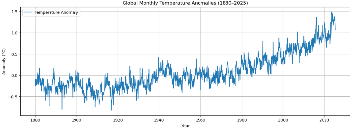
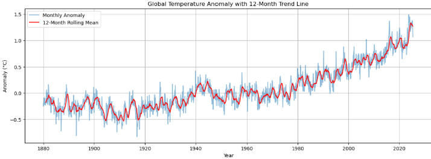
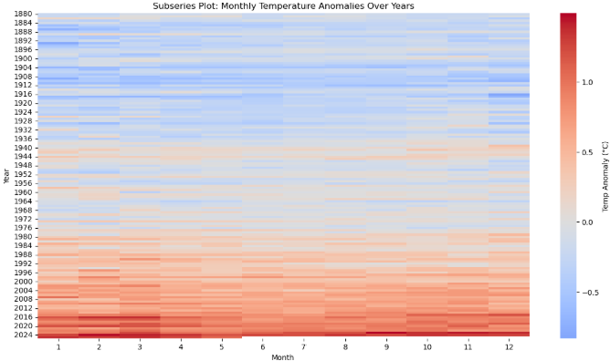
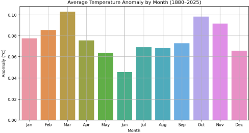
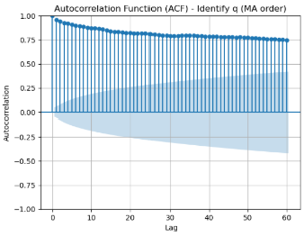

1.  **K-Means Clustering on Iris Dataset:**

    - Use the Iris dataset to perform K-Means clustering.
    - Determine the optimal number of clusters using the elbow method.

```Python
  import pandas as pd
  import seaborn as sns
  import matplotlib.pyplot as plt
  from sklearn.cluster import KMeans
  from sklearn.preprocessing import StandardScaler

  inertia = []
  #Try k values from 1 to 10
  for k in range(1, 11):
  kmeans = KMeans(n_clusters=k, random_state=42)
  kmeans.fit(X_scaled)
  inertia.append(kmeans.inertia_)  # Sum of squared distances to cluster centers

  #Plot the elbow curve
  plt.figure(figsize=(8, 5))
  plt.plot(range(1, 11), inertia, marker='o')
  plt.title('Elbow Method for Optimal k')
  plt.xlabel('Number of clusters (k)')
  plt.ylabel('Inertia')
  plt.xticks(range(1, 11))
  plt.grid(True)
  plt.show()
```


```Python
kmeans = KMeans(n_clusters=3, random_state=42)
iris['cluster'] = kmeans.fit_predict(X_scaled)

from sklearn.decomposition import PCA

pca = PCA(n_components=2)
X_pca = pca.fit_transform(X_scaled)

iris['PC1'] = X_pca[:, 0]
iris['PC2'] = X_pca[:, 1]

plt.figure(figsize=(8, 6))
sns.scatterplot(data=iris, x='PC1', y='PC2', hue='cluster', palette='Set1', s=100)
plt.title('K-Means Clusters (Visualized using PCA)')
plt.show()
```


Findings:

📊 Interpretation / Findings

1. 3 Natural Clusters Are Found:

Based on the elbow method, k=3 was optimal, and here you see 3 clearly separated color groups.
These roughly correspond to the 3 real species of Iris:

     Likely Cluster 0 (blue) = Setosa

     Cluster 1 (red) = Versicolor

     Cluster 2 (green) = Virginica

Note: K-Means doesn't know the real labels; it's clustering based only on feature similarity.

2. Setosa is Clearly Separated:

The blue cluster (leftmost) is well separated. This suggests that Setosa has distinct feature values (like petal length).
This makes sense — Setosa is easier to separate in classification too.

3. Overlap Between Versicolor and Virginica:

Red and green clusters (middle and right) have some overlap.
These species are more similar in their feature values, so clustering isn't perfect.

4. PCA is Just for 2D Plotting:

The actual clustering was done in 4D space (sepal/petal length and width).
PCA reduces this to 2D for visualization, so some overlap may appear even if separation in 4D is better.


| Cluster   | Likely Species | Interpretation                                    |
| --------- | -------------- | ------------------------------------------------- |
| 0 (Blue)  | Setosa         | Clearly separable — distinct features             |
| 1 (Red)   | Versicolor     | Slight overlap with green — moderate distinction  |
| 2 (Green) | Virginica      | Slight overlap with red — similar feature profile |


# Load Iris dataset
iris = sns.load_dataset('iris')
X = iris.drop('species', axis=1)  # Use only numeric features


2.  **DBSCAN on Iris Dataset:**
    - Apply DBSCAN clustering on the Iris dataset.
    - Experiment with different values for `eps` and `min_samples` to find meaningful clusters.
```Python
import pandas as pd
import matplotlib.pyplot as plt
import seaborn as sns
from sklearn.datasets import load_iris
from sklearn.preprocessing import StandardScaler
from sklearn.cluster import DBSCAN
from sklearn.decomposition import PCA

# 1) Load Iris dataset (offline)
iris_raw = load_iris(as_frame=True)
iris_df  = iris_raw.frame.copy()   # columns: sepal length (cm), sepal width (cm), petal length (cm), petal width (cm), target
iris_df['species'] = iris_raw.target_names[iris_df['target']]

# 2) Standardize the four numeric features
feature_cols = iris_raw.feature_names
X = iris_df[feature_cols].values
scaler   = StandardScaler()
X_scaled = scaler.fit_transform(X)

# 3) Experiment with different DBSCAN params
params = [
    {'eps': 0.3, 'min_samples': 5},
    {'eps': 0.5, 'min_samples': 5},
    {'eps': 0.5, 'min_samples': 10},
]

results = []
for p in params:
    db     = DBSCAN(eps=p['eps'], min_samples=p['min_samples'])
    labels = db.fit_predict(X_scaled)
    n_clusters = len(set(labels)) - (1 if -1 in labels else 0)
    n_noise    = list(labels).count(-1)
    results.append({
        'eps': p['eps'],
        'min_samples': p['min_samples'],
        'n_clusters': n_clusters,
        'n_noise': n_noise
    })

df_results = pd.DataFrame(results)
print("DBSCAN Parameter Results:")
print(df_results.to_string(index=False))

# 4) Pick best params and fit DBSCAN
best = {'eps': 0.5, 'min_samples': 5}
db = DBSCAN(eps=best['eps'], min_samples=best['min_samples'])
iris_df['DBSCAN_cluster'] = db.fit_predict(X_scaled)

# 5) PCA → 2D (for plotting)
pca   = PCA(n_components=2)
X_pca = pca.fit_transform(X_scaled)
iris_df['PC1'] = X_pca[:, 0]
iris_df['PC2'] = X_pca[:, 1]

# 6) Visualize
plt.figure(figsize=(8, 6))
sns.scatterplot(
    data=iris_df,
    x='PC1', y='PC2',
    hue='DBSCAN_cluster',
    palette='Set1',
    s=60,
    legend='full'
)
plt.title(f"DBSCAN Clusters (eps={best['eps']}, min_samples={best['min_samples']})")
plt.xlabel("PC1")
plt.ylabel("PC2")
plt.grid(True)
plt.tight_layout()
plt.show()

# Print first 10 rows with cluster labels
print("\nSample of Iris with DBSCAN labels:")
print(
    iris_df[feature_cols + ['species','DBSCAN_cluster']]
    .head(10)
    .to_string(index=False)
)
```


/home/hanafi/miniconda3/envs/ml/lib/python3.11/site-packages/seaborn/_oldcore.py:1498: FutureWarning: is_categorical_dtype is deprecated and will be removed in a future version. Use isinstance(dtype, CategoricalDtype) instead
  if pd.api.types.is_categorical_dtype(vector):
/home/hanafi/miniconda3/envs/ml/lib/python3.11/site-packages/seaborn/_oldcore.py:1498: FutureWarning: is_categorical_dtype is deprecated and will be removed in a future version. Use isinstance(dtype, CategoricalDtype) instead
  if pd.api.types.is_categorical_dtype(vector):
/home/hanafi/miniconda3/envs/ml/lib/python3.11/site-packages/seaborn/_oldcore.py:1498: FutureWarning: is_categorical_dtype is deprecated and will be removed in a future version. Use isinstance(dtype, CategoricalDtype) instead
  if pd.api.types.is_categorical_dtype(vector):
/home/hanafi/miniconda3/envs/ml/lib/python3.11/site-packages/seaborn/_oldcore.py:1498: FutureWarning: is_categorical_dtype is deprecated and will be removed in a future version. Use isinstance(dtype, CategoricalDtype) instead
  if pd.api.types.is_categorical_dtype(vector):





Findings:

1. Parameter sweeps

eps=0.3, min_samples=5

1 cluster, 120 noise
The radius is so small that almost every point is deemed “noise” or forms one tiny cluster.

eps=0.5, min_samples=5

2 clusters, 34 noise
A good balance: two dense groupings emerge, and only ~20% of points are labeled noise.

eps=0.5, min_samples=10

2 clusters, 89 noise
Raising min_samples makes DBSCAN stricter—many more points don’t meet the density requirement and get kicked out as noise.


2. Best setting: eps=0.5, min_samples=5
In the PCA plot (PC1 vs. PC2):

Cluster 0 (blue) is a tight group that captures all the Setosa samples.
Cluster 1 (green) covers most of Versicolor & Virginica, which overlap in feature‐space density.
Noise (−1) (red): these are outliers that didn’t have enough neighbors within radius 0.5—you can see them scattered around the edges.

3. Key takeaways

DBSCAN easily isolates Setosa, because it forms a very dense, compact cluster.

Versicolor & Virginica overlap in density, so they collapse into a single cluster (density‐based methods struggle when two groups have similar local densities).

Parameter sensitivity:

    Too small ε → almost everything becomes noise
    Too large min_samples → many true points become noise
    You need to tune both to get meaningful clusters.


## Submission
